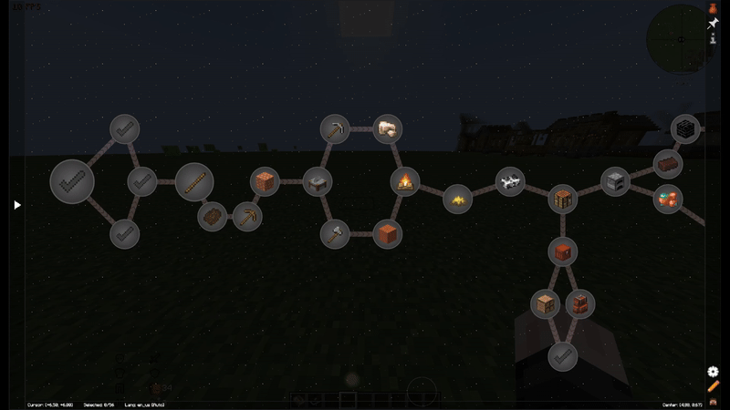

# Certain Questing Additions

A Minecraft mod that enhances the FTB Quests experience with smooth animations, visual effects, and quality-of-life improvements.



## Features

### Animations
- **Quest Hover Animation** - Smooth scaling and glow effect when hovering over quests
- **Panel Button Hover** - Animated feedback when hovering over navigation buttons
- **Quest Panel Animation** - Elegant appearance animation when opening quest details
- **Smooth Scrolling** - Fluid zooming in and out of the quest panel
- **Easing Functions** - Smooth animations using easing functions for natural motion

### Visual Effects
- **Custom Shader Background** - Optional shader-based backgrounds for the quest screen
- **Glow Effects** - Configurable glow intensity on hover for buttons and quests
- **EMI Integration** - Seamless integration with EMI recipe mod

### Configurable Options
All features can be toggled and customized through the in-game config:
- Toggle individual animations on/off
- Adjust glow opacity (0-255)
- Enable/disable shader background
- Control animation smoothness

## Supported Versions

| Minecraft Version | Fabric | Forge | NeoForge |
|-------------------|--------|-------|----------|
| 1.20.1            | ✅     | ✅    | ❌       |
| 1.21.1            | ✅     | ❌    | ✅       |

## Dependencies

- **Required**: [FTB Quests](https://www.curseforge.com/minecraft/mc-mods/ftb-quests) 2001.4.14+
- **Optional**: [EMI](https://www.curseforge.com/minecraft/mc-mods/emi) for recipe mod integration

## Installation

1. Download the appropriate JAR for your Minecraft version and mod loader
2. Place the JAR in your `mods` folder
3. Launch Minecraft

## Building Resource Packs

This mod includes shader templates that can be packaged as resource packs for use across multiple Minecraft versions:

```bash
./gradlew createMultiVersionResourcePacks
```

This creates resource packs in `build/resourcepacks/` that support Minecraft 1.20.1 - 1.21.1.

### Available Shaders
- `first_one.glsl`
- `galaxy_trip.glsl`
- `green_lights.glsl`
- `grid.glsl`
- `magma.glsl`
- `nebula.glsl`

## Development

### Prerequisites
- JDK 17+
- Gradle

### Building
```bash
./gradlew chiseledBuildAndCollect
```

## License

All rights reserved.
